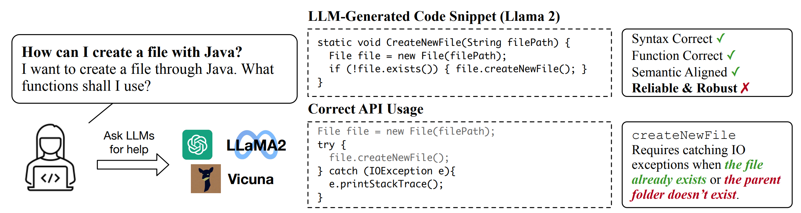

# RobustAPI

The official repo for the arxiv preprint [Can ChatGPT replace StackOverflow? A Study on Robustness and Reliability of Large Language Model Code Generation](https://arxiv.org/pdf/2308.10335.pdf).



In this dataset, we collect 1208 coding questions (`dataset/question.jsonl`) from StackOverflow on 24 representative Java APIs (see the details in `dataset/api_list.txt`). We summarize the
use patterns of these APIs (`eval/pat_list.txt`) and evaluate them on popular LLMs including GPT-3.5, GPT-4, Llama, PolyCoder and Vicuna.

# Setup

See [llama](https://github.com/facebookresearch/llama), [Vicuna](https://github.com/vicuna-tools/vicuna-installation-guide), [GPT](https://platform.openai.com/docs/guides/gpt) for setting up instructions.

Install the dependencies:
```
pip install -e .
```

# Prompts
The prompt we use in evaluating is generated by `prompt.py`.

To generate responses from the large language models:

For GPT:
```
python askGPT.py --shots {-1 for one irrelevant shot, 0 for zero-shot, 1 for one-shot} --save_dir {output_dir} --engine {model} --api_keys_file {key_file}
```

For other open-source model, take Llama as an example:
```
python askLlama2.py --ckpt_dir ./llama/llama-2-7b/ --tokenizer_path ./llama/tokenizer.model --question ./dataset/question.jsonl --result_dir {output_dir} --shot_number {-1 for one irrelevant shot, 0 for zero-shot, 1 for one-shot}
```

# Evaluator
To evaluate the API misuse rate in the question answers:
```
python eval/evaluator.py --answer_dir {answer_dir} --model {model} > {output_file}
```
Since the API checker is written in Java, you need to have [Java Runtime Environment](https://ubuntu.com/tutorials/install-jre) installed on your machine. In our experimetns, it is validated to work under version `OpenJDK 11.0.20.1`.

We acknowledge ICSE'18 paper [ExampleCheck](https://tianyi-zhang.github.io/files/icse2018-examplecheck.pdf), based on which we build the checker.

# Results of Evaluation
The code responses are in `results/`. Each model has a directory, in which every json file corresponds to the response from the large language model to the Stack Overflow questions. The numbering follows the same numbering in `dataset/question.jsonl`.

# Citation
Please cite the paper and star this repo if you use this dataset or find it interesting. Feel free to contact lizhong@ucsd.edu or open an issue if you have any questions.
```
@misc{zhong2023chatgpt,
      title={Can ChatGPT replace StackOverflow? A Study on Robustness and Reliability of Large Language Model Code Generation}, 
      author={Li Zhong and Zilong Wang},
      year={2023},
      eprint={2308.10335},
      archivePrefix={arXiv},
      primaryClass={cs.CL}
}
```
